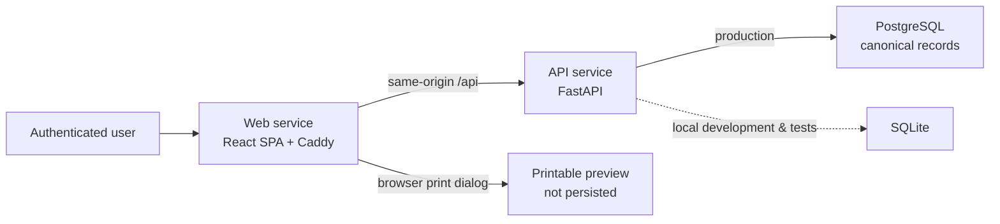

# Multi-Rate Pricing Calculator

> [!IMPORTANT]
> **Agents must start with [AGENTS.md](AGENTS.md).** It defines the non-negotiable
> financial, ownership, lifecycle, testing, and deployment rules for this repository.
> Human contributors should then read [CONTRIBUTING.md](CONTRIBUTING.md).

## What it does

Multi-Rate Pricing Calculator is a full-stack workspace for creating client pricing
documents with line-level discounts and tax rates. It calculates each line
server-side, lets users work in a supported document currency, locks finalized
documents, and reports inclusive date-range totals in separate currency groups.

The application is deliberately not an invoicing or foreign-exchange system: one
document has one currency, totals are never trusted from the browser, and a report
never combines money across currencies. Printable preview is browser-only; the
application does not generate or persist PDFs.

## Links

| Resource | Link |
| --- | --- |
| Sign up locally | [http://localhost:5173/signup](http://localhost:5173/signup) |
| Repository | [RahulGusai/pricing-calculator](https://github.com/RahulGusai/pricing-calculator) |
| Deployment guide | [Railway setup](docs/deployment.md) |
| API contract | [OpenAPI after local start](http://localhost:8000/openapi.json) |

No public production domain is documented in this repository. The local sign-up and
OpenAPI links are available after starting the services below.

## System at a glance



Railway deploys `web` and `api` as independent services. Caddy routes browser
requests under `/api/*` to FastAPI on Railway private networking; PostgreSQL stores
the complete canonical record.

## Design choices

### Exact calculations and rounding

- Money, fixed discounts, and percentage rates are submitted as strings with at most
  two decimal places. The server converts them to integers before any arithmetic.
- Quantity is a positive whole-number string, stored as an integer. It never accepts
  fractional units.
- Discount is applied before tax. Each line component rounds `HALF_UP` to the nearest
  minor currency unit, then document totals sum those already-rounded line values.
- The reference pricing document totals **421.50**.

### Currency model

- **Default:** `USD`, configured with `PRICING_DEFAULT_CURRENCY`.
- **Supported currencies:** `USD`, `INR`, and `AED` by default, configured with the
  comma-separated `PRICING_SUPPORTED_CURRENCIES` setting.
- The frontend reads enabled currencies from `GET /api/v1/config/currencies`; it does
  not own its own currency list.
- A draft can select one supported currency. Finalized currency is immutable, there is
  no FX conversion, and reports return one totals row per currency.

## Tech stack

### Backend

| Technology | Role |
| --- | --- |
| Python 3.12+, FastAPI, Pydantic | Typed HTTP API and request/response validation |
| SQLAlchemy 2 + Alembic | Relational persistence and versioned schema changes |
| PostgreSQL | Production source of truth on Railway |
| SQLite | Local development and focused test database only |
| Argon2id + opaque HTTP-only sessions | Password hashing, cookie sessions, and CSRF-protected mutations |

The API owns the following canonical tables:

| Table | Purpose |
| --- | --- |
| `users` | Account identity, normalized email, workspace details, and Argon2id password hash. |
| `sessions` | Hashed, revocable opaque browser sessions with expiry and last-seen metadata. |
| `documents` | Owner-scoped document header, currency, lifecycle state, dates, and materialized totals. |
| `line_items` | Ordered document lines, normalized pricing inputs, and server-calculated line totals. |

There is no PDF, object-storage, or artifact-metadata table. Printable output is
derived from an authorized document response in the browser.

### Frontend

| Technology | Role |
| --- | --- |
| React 19 + TypeScript + Vite | Single-page application and production bundle |
| React Router | Protected, URL-addressable application flows |
| TanStack Query | API server state, caching, and invalidation |
| React Hook Form + Zod | Dynamic line-item forms and client-side boundary validation |
| Generated FastAPI OpenAPI types | Checked-in contract declarations consumed by the API adapter |
| Source Sans 3 + Source Serif 4 | Bundled operational typography and restrained editorial emphasis |
| Phosphor icons | Consistent accessible interface icons |
| Vitest + Testing Library + MSW | Unit/UI coverage and explicit test-only API contract double |

## Repository layout

```text
.
├── apps/
│   ├── api/          # FastAPI service, Alembic migrations, and API tests
│   └── web/          # React application, generated contract, and UI tests
├── docs/             # Architecture, deployment guide, research, and ADRs
├── AGENTS.md         # Rules every agent must read first
├── CONTRIBUTING.md   # Local workflow and review expectations
└── README.md
```

## Run locally

Prerequisites: Python 3.12+, [uv](https://docs.astral.sh/uv/), a current Node.js LTS
release, and npm.

```bash
# Terminal 1 — API
cd apps/api
uv sync --all-groups
cp .env.example .env
uv run alembic upgrade head
uv run uvicorn pricing_api.main:app --reload --host 0.0.0.0 --port 8000

# Terminal 2 — web
cd apps/web
npm ci
npm run dev
```

Open [http://localhost:5173/signup](http://localhost:5173/signup) to create a local
account. Vite calls FastAPI at `http://localhost:8000` during development; Railway
uses Caddy's same-origin `/api` proxy.

`VITE_API_MODE=mock` enables the in-memory MSW contract double for tests and visual
work only. It is not a production data source.

## Verification commands

```bash
# API — run from apps/api
uv run pytest
uv run ruff check src tests
uv run alembic check

# Web — run from apps/web
npm run typecheck
npm run lint
npm run test
npm run build
npm run test:sites
```

When a FastAPI contract changes, regenerate and commit the web declarations:

```bash
cd apps/web
npm run generate:api
npm run check:api
```

## Further reading

- [Architecture](docs/architecture.md)
- [Frontend/backend contract](docs/frontend-backend-migration-plan.md)
- [Deployment guide](docs/deployment.md)
- [Decision records](docs/decisions/README.md)
- [Web service README](apps/web/README.md)
- [API service README](apps/api/README.md)
