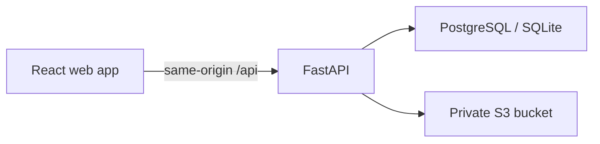

# Multi-Rate Pricing Calculator

A full-stack take-home project for creating pricing documents with per-line
discounts and taxes, enforcing a draft/finalized lifecycle, and reporting totals
over an issue-date range.

> **Current checkpoint:** repository scaffold and visual design exploration only.
> No frontend or backend application code has been implemented. Frontend work
> starts only after a visual direction is approved.

## Links

| Surface | URL |
| --- | --- |
| Frontend | Pending deployment |
| API | Pending deployment |
| OpenAPI | Pending deployment |
| Repository | <https://github.com/RahulGusai/pricing-calculator> |

## Product scope

- Email/password sign-up and login with strict per-user data isolation.
- Draft pricing documents with editable metadata and line items.
- Fixed or percentage discount per line, followed by percentage tax.
- Server-authoritative line and document totals with a documented rounding policy.
- Finalized documents that are immutable through every write path.
- Inclusive issue-date range reporting for document count, grand total, tax, and
  discount.
- Immutable finalized PDF artifacts in private S3-compatible object storage.
- Optional duplication of a finalized document into a new draft.

## Planned architecture



The relational database is the source of truth for users, documents, line items,
status, and totals. S3 stores immutable generated artifacts, never the mutable
business record. Production will use PostgreSQL; SQLite remains a local and test
convenience.

### Frontend - approved stack, visual direction pending

- React 19, TypeScript, and Vite.
- React Router for application routes.
- TanStack Query for server state.
- React Hook Form and Zod for accessible dynamic forms.
- Mock Service Worker with deterministic fixtures and local persistence during the
  frontend-first phase.
- Vitest, Testing Library, and Playwright.
- Caddy serving the production bundle and proxying `/api` to FastAPI on Railway.

### Backend - planned

- FastAPI and Pydantic.
- SQLAlchemy 2 and Alembic.
- PostgreSQL on Railway; SQLite locally and in focused tests.
- Decimal calculations with integer minor units in persistence.
- Private S3-compatible storage with short-lived authorized downloads.

See [architecture](docs/architecture.md), the
[frontend design brief](docs/frontend-design-brief.md), and the
[decision log](docs/decisions/README.md) for the reasoning behind these choices.

## Repository layout

```text
.
├── apps/
│   ├── api/          # FastAPI service boundary; documentation only today
│   └── web/          # React service boundary; documentation only today
├── docs/
│   ├── decisions/    # Architecture decision records
│   ├── architecture.md
│   └── frontend-design-brief.md
├── AGENTS.md         # Rules for coding agents and contributors
├── CONTRIBUTING.md
└── README.md
```

## Running the project

There is intentionally nothing runnable at this design checkpoint. No dependency
manifest or placeholder application is committed because that would imply an
implementation before design approval.

Once the selected frontend direction is approved, this section will contain only
commands verified from a clean clone, including:

1. prerequisites and environment setup;
2. mocked frontend development and tests;
3. API, migrations, and local database setup;
4. end-to-end development; and
5. Railway deployment.

## Calculation policy to implement

All values enter and leave the API as fixed decimal strings. Binary floating point
is forbidden for authoritative calculations. For each line, round monetary
components to two decimal places using `ROUND_HALF_UP`:

1. `subtotal = round(quantity x unit_price)`
2. `discount = fixed_amount` or `round(subtotal x percent / 100)`
3. `after_discount = subtotal - discount`
4. `tax = round(after_discount x tax_percent / 100)`
5. `line_total = after_discount + tax`

Document totals are sums of the already-rounded line values. A fixed discount
greater than the line subtotal is rejected rather than clamped.

The assignment's reference document must produce:

| Total | Amount |
| --- | ---: |
| Subtotal | 450.00 |
| Discount | 40.00 |
| Tax | 11.50 |
| Grand total | **421.50** |

## Document lifecycle

- New documents are always drafts.
- Only drafts may change metadata, ordering, or line items.
- Finalization recalculates and validates the entire document server-side.
- A finalized document cannot be edited or deleted through normal CRUD endpoints.
- Duplication creates new IDs and a new draft; it never reopens the source.
- Artifact access is authorized by the API before a short-lived download is issued.

## Assumptions

- Report date bounds are inclusive and default to all document statuses.
- Currency is stored per document; the first UI iteration displays USD.
- Quantity supports up to four decimal places; money and rates accept two.
- A draft may be empty, but finalization requires at least one valid line.
- Production uses PostgreSQL and S3; Railway's ephemeral filesystem is not storage.

## Before production

Add refresh-token rotation or server sessions, CSRF protection where applicable,
optimistic concurrency, a durable artifact outbox, audit events, structured tracing,
rate limiting, database backups, S3 lifecycle/versioning, security scanning, and
load/accessibility testing.

## Contributing

Read [AGENTS.md](AGENTS.md) before making changes and follow
[CONTRIBUTING.md](CONTRIBUTING.md). Do not begin frontend implementation until the
selected visual direction is explicitly approved.
