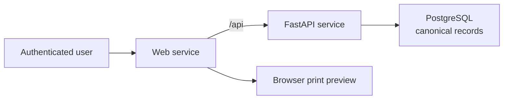

# Multi-Rate Pricing Calculator

> [!IMPORTANT]
> **Agents must read [AGENTS.md](AGENTS.md) before changing this repository.** It
> contains the pricing, ownership, lifecycle, testing, and deployment rules.
> Contributors should also read [CONTRIBUTING.md](CONTRIBUTING.md).

## What it does

Multi-Rate Pricing Calculator lets a user prepare a pricing document with line-item
discounts and tax rates, then finalize it as a read-only record. The API calculates
every line and total. A document uses one currency, and a report returns a separate
totals row for every currency in the selected date range.

It is not an invoicing or foreign-exchange product. The browser never supplies
authoritative totals, the service does not combine currencies, and printable preview
uses the browser's print dialog instead of producing a stored PDF.

## Links

| Resource | Link |
| --- | --- |
| Live application | [Sign up](https://pricing-desk.up.railway.app/signup) |
| Repository | [RahulGusai/pricing-calculator](https://github.com/RahulGusai/pricing-calculator) |

## System at a glance



The web and API services deploy separately. The web service forwards `/api` requests
to the API service; PostgreSQL holds the application record.

## Tech stack

- FastAPI
- PostgreSQL

## Repository layout

```text
.
├── apps/
│   ├── api/          # FastAPI service, migrations, and API tests
│   └── web/          # Web application and UI tests
├── docs/             # Architecture, deployment notes, and decisions
├── AGENTS.md         # Rules every agent must read first
├── CONTRIBUTING.md   # Contributor workflow and review expectations
└── README.md
```

## Prerequisites

- Python 3.12 or later
- uv
- A current Node.js LTS release and npm

SQLite is included with Python, so no database server is needed for this setup.

## Set up and run with SQLite

1. Clone the repository and enter it.

   ```bash
   git clone https://github.com/RahulGusai/pricing-calculator.git
   cd pricing-calculator
   ```

2. In one terminal, install the API dependencies, create the SQLite configuration,
   apply migrations, and start FastAPI.

   ```bash
   cd apps/api
   uv sync --all-groups
   cp .env.example .env
   uv run alembic upgrade head
   uv run uvicorn pricing_api.main:app --reload --host 0.0.0.0 --port 8000
   ```

   `.env.example` sets `DATABASE_URL=sqlite:///./pricing-calculator.db` and allows
   requests from the web service at `http://localhost:5173`.

3. In a second terminal, install and start the web service.

   ```bash
   cd apps/web
   npm ci
   npm run dev
   ```

4. Open `http://localhost:5173/signup`, create an account, and begin a pricing
   document.

## Design decisions

### Calculation and rounding policy

The service accepts money and percentage values as strings with no more than two
decimal places, converts them to integers at the boundary, and does no pricing math
with binary floating point. Quantity is a positive whole number. Fixed discounts are
minor-currency amounts; percentage inputs are percentage points scaled by 100.

For USD, 1 dollar is 100 cents. Consider one line with quantity `3`, unit price
`19.99`, a `12.50%` discount, and `8.25%` tax:

| Step | Integer calculation | Result |
| --- | --- | --- |
| Normalize inputs | `19.99 → 1999` cents; `12.50 → 1250`; `8.25 → 825` | Integer inputs |
| Subtotal | `3 × 1999` | `5997` cents = `$59.97` |
| Discount | `round half up(5997 × 1250 ÷ 10000)` | `750` cents = `$7.50` |
| Amount after discount | `5997 − 750` | `5247` cents = `$52.47` |
| Tax | `round half up(5247 × 825 ÷ 10000)` | `433` cents = `$4.33` |
| Grand total | `5247 + 433` | `5680` cents = `$56.80` |

The application applies discount before tax. It rounds each line component half up
to the currency's minor unit, then sums those rounded line values for document
totals. USD is the default currency. `USD`, `INR`, and `AED` are enabled by default
and can be configured through the API service environment.

### Finalize and immutability rules

- Drafts can change title, customer, dates, currency, and ordered line items. The API
  recalculates totals for every accepted draft update.
- Finalizing revalidates the complete document, recalculates it, and locks its
  content. A finalized document can be viewed and printed but cannot be edited.
- The owner can permanently delete either a draft or finalized document only after
  explicit confirmation. A finalized document can also be duplicated into an
  independent draft.

### Assumptions and tradeoffs

- One document has one currency. There is no FX conversion, so reports keep currencies
  separate rather than manufacturing a mixed-currency total.
- The browser handles printable preview. This keeps the API stateless and avoids
  document-storage and retention requirements.
- Two fractional digits cover the supported currencies and keep the integer model
  straightforward.

### What to improve before production

- Add account recovery, email verification, and a configurable session-management
  screen.
- Add audit history for finalized-document deletion and operational monitoring for
  failed jobs, auth events, and database performance.
- Exercise backup/restore and upgrade procedures against the production PostgreSQL
  service before relying on the deployment for customer data.

## Verification commands

```bash
# API — run from apps/api
uv run pytest
uv run ruff check src tests
uv run alembic check

# Web — run from apps/web
npm run typecheck
npm run lint
npm run test
npm run build
npm run test:sites
```

When the FastAPI contract changes, regenerate and commit the web declarations:

```bash
cd apps/web
npm run generate:api
npm run check:api
```
