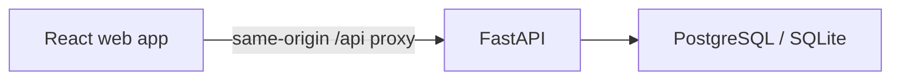

# Multi-Rate Pricing Calculator

A full-stack take-home project for creating pricing documents with per-line
discounts and taxes, enforcing a draft/finalized lifecycle, and reporting totals
over an issue-date range.

> **Required first step for every human or agent:** read [AGENTS.md](AGENTS.md)
> before inspecting, planning, editing, testing, or running any command in this
> repository. It contains the non-negotiable pricing, ownership, lifecycle, and
> deployment rules.

> **Current checkpoint:** FastAPI is the React application's normal local and
> production API boundary. The frontend consumes checked-in types generated from
> FastAPI OpenAPI, uses cookie sessions with in-memory CSRF state, and leaves MSW as
> an explicit, in-memory test/visual mode only. Railway resources and a live
> deployment have not been created or verified.

## Links

| Surface | URL |
| --- | --- |
| Frontend | Pending Railway deployment |
| API | Local: `http://localhost:8000` after setup; Railway deployment pending |
| OpenAPI | Local: `http://localhost:8000/openapi.json` after setup |
| Repository | <https://github.com/RahulGusai/pricing-calculator> |

No live application URL is claimed at this checkpoint.

## Frontend visual direction

| Visual | Purpose |
| --- | --- |
| [Original Option 1 reference](docs/visuals/revised-option-1.png) | Historical visual baseline; current editor rules are in ADR 0007 |
| [Light editor](docs/visuals/editor-light.jpg) | Operational editing workspace |
| [Dark editor](docs/visuals/editor-dark.jpg) | Low-glare editing workspace |
| [Calculation summary](docs/visuals/editor-light-summary.jpg) | Auditable server-returned totals |
| [Sign in](docs/visuals/login-light.jpg) | Authentication entry point |

The current contained, Light/Dark-only editor contract is recorded in
[ADR 0007](docs/decisions/0007-contained-two-mode-document-editor.md); older visual
artifacts are references rather than pixel-accurate implementation targets.

## Product scope

- Email/password sign-up and login with strict per-user data isolation.
- Draft pricing documents with editable metadata and line items.
- Fixed or percentage discount per line, followed by a directly entered percentage
  tax rate.
- Server-authoritative line and document totals with a documented rounding policy.
- Finalized document contents that remain immutable, with confirmed permanent deletion
  available as a separate lifecycle operation.
- Inclusive issue-date range reporting with one subtotal/discount/tax/total row per
  document currency.
- Print-ready browser preview for drafts and finalized documents; no generated PDF or
  object-storage subsystem.
- Duplication of a finalized document into a new draft.

## Architecture



The relational database is the source of truth for users, documents, line items,
status, and totals. Production uses PostgreSQL; SQLite remains a local and
focused-test convenience. Printable output is rendered from authorized API data in
the browser and is not persisted as a backend file.

### Frontend - implemented locally

- React 19, TypeScript, and Vite.
- React Router for protected layouts and URL-addressable workflows.
- TanStack Query for FastAPI server state and cache invalidation.
- React Hook Form and Zod for dynamic line-item forms and boundary validation.
- Generated FastAPI OpenAPI declarations plus a handwritten API adapter; MSW is
  limited to explicit in-memory unit/visual testing.
- Phosphor icons with text labels for consequential actions.
- Bundled Source Sans 3 and Source Serif 4 variable fonts, avoiding runtime font requests.
- Light and Dark appearance controls in the sidebar utility area; finalized read-only
  behavior remains a lifecycle state rather than a third appearance mode.
- The migration target is backend-configured USD, INR, and AED only, with no implied
  foreign-exchange conversion and currency-separated report totals.
- Vitest, Testing Library, jest-dom, user-event, and jsdom for behavior-focused tests.
- The approved **Option 1 evolution**: an editorial financial workspace with
  high-density data where needed, quiet paper-like surfaces, and restrained accents.

These libraries have deliberately separate jobs. They do not calculate authoritative
totals or create a second domain layer in React. See
[ADR 0002](docs/decisions/0002-react-vite-mock-first.md) and the
[frontend design brief](docs/frontend-design-brief.md).

### Backend - implemented locally

- FastAPI and Pydantic schemas under `apps/api`.
- SQLAlchemy 2 models and Alembic migrations, including removal of the retired
  artifact table in `0002_remove_artifacts`.
- PostgreSQL for Railway production; SQLite only for local development and focused
  tests. Production configuration rejects SQLite.
- Opaque, database-backed sessions in an `HttpOnly` cookie; only a session-token hash
  is stored, and authenticated mutations require a server-derived CSRF header.
- Integer fixed-point calculations and transactional draft/finalized lifecycle state.

See [architecture](docs/architecture.md), the
[decision log](docs/decisions/README.md), and the
[product-pattern research](docs/research/frontend-product-patterns.md).

## Repository layout

```text
.
├── apps/
│   ├── api/          # FastAPI service, Alembic migrations, tests, and Railway config
│   └── web/          # React frontend, FastAPI adapter, and test-only mock
├── docs/
│   ├── decisions/    # Architecture decision records
│   ├── research/     # First-party product-pattern evidence
│   ├── architecture.md
│   └── frontend-design-brief.md
├── AGENTS.md         # Repository-wide rules for agents and contributors
├── CONTRIBUTING.md
└── README.md
```

## Run the full application locally

Prerequisites: a current Node.js LTS release and npm.

```bash
cd apps/api
uv sync --all-groups
cp .env.example .env
uv run alembic upgrade head
uv run uvicorn pricing_api.main:app --reload --host 0.0.0.0 --port 8000

# In a second terminal:
cd apps/web
npm ci
npm run dev
```

The web manifest currently defines these checks:

```bash
npm run test
npm run typecheck
npm run lint
npm run build
npm run test:sites
```

Use the sign-up page to create a local account. Vite's real path calls
`http://localhost:8000` in development; Railway uses Caddy's same-origin `/api`
proxy. `VITE_API_MODE=mock` is an explicit test/visual-only opt-in and production
builds never start it.

## Run the backend locally

Prerequisites: Python 3.12+ and [uv](https://docs.astral.sh/uv/).

```bash
cd apps/api
uv sync --all-groups
cp .env.example .env
uv run alembic upgrade head
uv run uvicorn pricing_api.main:app --reload --host 0.0.0.0 --port 8000
```

Useful backend checks:

```bash
cd apps/api
uv run pytest
uv run ruff check src tests
uv run alembic check
```

Local development uses SQLite by default; it never creates a PDF directory. See
[deployment guidance](docs/deployment.md) for the Railway PostgreSQL configuration.

## FastAPI contract boundary

FastAPI's generated OpenAPI schema is the browser contract source of truth.
`apps/web/src/lib/generated/openapi.ts` is generated with `npm run generate:api`,
while `apps/web/src/lib/api.ts` remains the component-facing adapter. The browser
uses an HTTP-only cookie, stores only the CSRF token in module memory, and sends no
bearer access token. UI writes submit input-only DTOs; totals, lifecycle status, and
currency-separated report groups come from the API.

MSW remains deterministic coverage for the same contract, including cookie/CSRF
semantics, but it is non-persistent and starts only with `VITE_API_MODE=mock`.

## Calculation policy

All money, quantity, fixed-discount, and percentage values enter and leave the API as
fixed decimal strings with at most two decimal places. Binary floating point is
forbidden for authoritative calculations. The backend immediately converts values to
integers:

| Value | Internal representation |
| --- | --- |
| USD | cents: `1 USD = 100` |
| INR | paise: `1 INR = 100` |
| AED | fils: `1 AED = 100` |
| Quantity | integer scaled by `100` (`"3.00"` → `300`) |
| Percentage | integer scaled by `100` (`"12.50%"` → `1250`) |

For each line, monetary components round to the nearest minor unit using
`ROUND_HALF_UP`:

1. `subtotal = round(quantity x unit_price)`
2. `discount = fixed_amount` or `round(subtotal x percent / 100)`
3. `after_discount = subtotal - discount`
4. `tax = round(after_discount x tax_percent / 100)`
5. `line_total = after_discount + tax`

Document totals sum the already-rounded line values. A fixed discount greater than
the rounded line subtotal is rejected rather than clamped. For a percentage rate
stored as `rateScaled`, the integer calculation is
`round_half_up(amountMinor * rateScaled / 10000)`. A document has exactly one
currency; changing a draft currency never performs foreign-exchange conversion, and
reports never combine money from different currencies.

The assignment reference must produce:

| Total | Amount |
| --- | ---: |
| Subtotal | 450.00 |
| Discount | 40.00 |
| Tax | 11.50 |
| Grand total | **421.50** |

## Document lifecycle

- New documents are drafts.
- Only drafts may change metadata, ordering, or line items.
- Finalization recalculates and validates the entire document server-side.
- A finalized document cannot be edited. Whole-document deletion is a separate,
  owner-authorized operation requiring `{ "confirm": true }` and a deliberate UI
  confirmation.
- Duplication creates new IDs and a new draft; it never reopens the source.
- Deleting a draft or finalized document removes the owner-scoped relational record
  after explicit confirmation.
- Preview remains available for drafts and finalized documents and can invoke the
  browser's print dialog; it does not generate or download a backend PDF.

## Deployment intent

The monorepo is configured for two independently built Railway services plus Railway
PostgreSQL. The frontend will serve its production bundle and route API traffic to
FastAPI; the API alone receives database and session secrets. The API's Railway config
runs Alembic before deployment and exposes `/health`. Railway services, domains,
environment values, and live URLs have not yet been configured or verified.

## Assumptions and production follow-ups

- Report date bounds are inclusive and default to all document statuses.
- Currency is stored per document and limited to backend-configured USD, INR, and AED.
- Money, quantity, and rates accept at most two decimal places and normalize to exactly
  two decimal places in responses. Browser fields prevent a third fractional digit
  from entering form state; FastAPI still validates and normalizes every submitted
  decimal string.
- A draft may be empty, but finalization requires at least one valid line.
- No filesystem or bucket is required because canonical documents remain relational
  and printable output is browser-only.

Before production, add session-device management, optimistic-concurrency versioning,
audit events, structured tracing, rate limiting, backups, security scanning, and
measured load/accessibility budgets.

## Contributing

Read [AGENTS.md](AGENTS.md) before making changes and follow
[CONTRIBUTING.md](CONTRIBUTING.md). The selected Option 1 direction is approved for
frontend work. The [frontend migration record](docs/frontend-backend-migration-plan.md)
defines the FastAPI contract and completed cutover scope.
