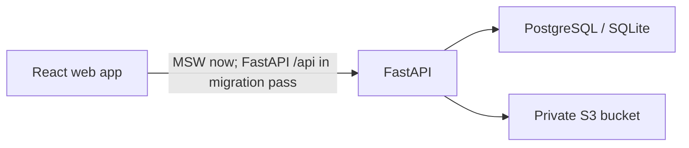

# Multi-Rate Pricing Calculator

A full-stack take-home project for creating pricing documents with per-line
discounts and taxes, enforcing a draft/finalized lifecycle, and reporting totals
over an issue-date range.

> **Required first step for every human or agent:** read [AGENTS.md](AGENTS.md)
> before inspecting, planning, editing, testing, or running any command in this
> repository. It contains the non-negotiable pricing, ownership, lifecycle, and
> deployment rules.

> **Current checkpoint:** the FastAPI service, database migration, local artifact
> adapter, and backend test suite are implemented. The React workspace still uses its
> deterministic mock boundary until the documented frontend migration pass is applied.
> Railway resources and a live deployment have not been created or verified.

## Links

| Surface | URL |
| --- | --- |
| Frontend | Pending Railway deployment |
| API | Local: `http://localhost:8000` after setup; Railway deployment pending |
| OpenAPI | Local: `http://localhost:8000/openapi.json` after setup |
| Repository | <https://github.com/RahulGusai/pricing-calculator> |

No live application URL is claimed at this checkpoint.

## Frontend preview

The mock workspace includes demo access for
`avery@northstar.example` / `pricing123`.

| Visual | Purpose |
| --- | --- |
| [Approved direction](docs/visuals/revised-option-1.png) | Evolved Option 1 desktop target |
| [Light editor](docs/visuals/editor-light.jpg) | Operational editing workspace |
| [Dark editor](docs/visuals/editor-dark.jpg) | Low-glare editing workspace |
| [Reading editor](docs/visuals/editor-reading.jpg) | Distraction-reduced review workspace |
| [Calculation summary](docs/visuals/editor-light-summary.jpg) | Auditable server-returned totals |
| [Sign in](docs/visuals/login-light.jpg) | Demo authentication entry point |

## Product scope

- Email/password sign-up and login with strict per-user data isolation.
- Draft pricing documents with editable metadata and line items.
- Fixed or percentage discount per line, followed by percentage tax.
- Server-authoritative line and document totals with a documented rounding policy.
- Finalized document contents that remain immutable, with confirmed permanent deletion
  available as a separate lifecycle operation.
- Inclusive issue-date range reporting for document count, grand total, tax, and
  discount.
- Immutable finalized PDF artifacts in private S3-compatible object storage.
- Duplication of a finalized document into a new draft.

## Architecture



The relational database will be the source of truth for users, documents, line
items, status, and totals. S3 will store immutable generated artifacts, not the
mutable business record. Production will use PostgreSQL; SQLite remains a local and
focused-test convenience.

### Frontend - current phase

- React 19, TypeScript, and Vite.
- React Router for protected layouts and URL-addressable workflows.
- TanStack Query for asynchronous mock/API state and cache invalidation.
- React Hook Form and Zod for dynamic line-item forms and boundary validation.
- Mock Service Worker for a network-realistic, replaceable REST boundary.
- Phosphor icons with text labels for consequential actions.
- Bundled Source Sans 3 and Source Serif 4 variable fonts, avoiding runtime font requests.
- The migration target is backend-configured USD, INR, and AED only, with no implied
  foreign-exchange conversion and currency-separated report totals.
- Vitest, Testing Library, jest-dom, user-event, and jsdom for behavior-focused tests.
- The approved **Option 1 evolution**: an editorial financial workspace with
  high-density data where needed, quiet paper-like surfaces, and restrained accents.

These libraries have deliberately separate jobs. They do not calculate authoritative
totals or create a second domain layer in React. See
[ADR 0002](docs/decisions/0002-react-vite-mock-first.md) and the
[frontend design brief](docs/frontend-design-brief.md).

### Backend - implemented locally

- FastAPI and Pydantic schemas under `apps/api`.
- SQLAlchemy 2 models and Alembic migration `0001_initial_schema`.
- PostgreSQL for Railway production; SQLite only for local development and focused
  tests. Production configuration rejects SQLite.
- Opaque, database-backed sessions in an `HttpOnly` cookie; only a session-token hash
  is stored, and authenticated mutations require a server-derived CSRF header.
- Integer fixed-point calculations, private S3-compatible PDF storage, and short-lived
  authorized artifact downloads. The local adapter exists only for development/tests;
  production configuration rejects local artifact storage.

See [architecture](docs/architecture.md), the
[decision log](docs/decisions/README.md), and the
[product-pattern research](docs/research/frontend-product-patterns.md).

## Repository layout

```text
.
├── apps/
│   ├── api/          # FastAPI service, Alembic migrations, tests, and Railway config
│   └── web/          # React frontend and mock API
├── docs/
│   ├── decisions/    # Architecture decision records
│   ├── research/     # First-party product-pattern evidence
│   ├── architecture.md
│   └── frontend-design-brief.md
├── AGENTS.md         # Repository-wide rules for agents and contributors
├── CONTRIBUTING.md
└── README.md
```

## Run the frontend

Prerequisites: a current Node.js LTS release and npm.

```bash
cd apps/web
npm ci
npm run dev
```

The web manifest currently defines these checks:

```bash
npm run test
npm run typecheck
npm run lint
npm run build
npm run test:sites
```

The frontend implementation handoff on 2026-08-10 passed test, typecheck, lint,
production build, and Sites packaging checks. The backend implementation, migration,
and local API checks are documented below; frontend-to-FastAPI conformance and live
Railway verification remain pending.

## Run the backend locally

Prerequisites: Python 3.12+ and [uv](https://docs.astral.sh/uv/).

```bash
cd apps/api
uv sync --all-groups
cp .env.example .env
uv run alembic upgrade head
uv run uvicorn pricing_api.main:app --reload --host 0.0.0.0 --port 8000
```

Useful backend checks:

```bash
cd apps/api
uv run pytest
uv run ruff check src tests
uv run alembic check
```

Local development uses SQLite and a local PDF directory from `.env`; neither is a
valid production configuration. See [deployment guidance](docs/deployment.md) for
Railway PostgreSQL and private S3-compatible Bucket configuration.

## Mock-first contract

The frontend talks to Mock Service Worker handlers rather than importing fixtures
inside components. The mock boundary models latency, authentication, ownership,
validation, draft/finalized conflicts, reports, and server-shaped decimal-string
totals. Deterministic fixtures include the assignment reference document and an
isolated second tenant.

FastAPI's generated OpenAPI schema is now the contract source of truth. The required
mock-to-real migration is documented in
[the frontend migration plan](docs/frontend-backend-migration-plan.md), including
cookie sessions, CSRF, USD/INR/AED configuration, input/output DTO separation,
two-decimal validation, and currency-separated reports. The mock must not be retired
until that conformance pass compares status codes, error envelopes, field names,
decimal serialization, and lifecycle behavior.

## Calculation policy

All money, quantity, fixed-discount, and percentage values enter and leave the API as
fixed decimal strings with at most two decimal places. Binary floating point is
forbidden for authoritative calculations. The backend immediately converts values to
integers:

| Value | Internal representation |
| --- | --- |
| USD | cents: `1 USD = 100` |
| INR | paise: `1 INR = 100` |
| AED | fils: `1 AED = 100` |
| Quantity | integer scaled by `100` (`"3.00"` → `300`) |
| Percentage | integer scaled by `100` (`"12.50%"` → `1250`) |

For each line, monetary components round to the nearest minor unit using
`ROUND_HALF_UP`:

1. `subtotal = round(quantity x unit_price)`
2. `discount = fixed_amount` or `round(subtotal x percent / 100)`
3. `after_discount = subtotal - discount`
4. `tax = round(after_discount x tax_percent / 100)`
5. `line_total = after_discount + tax`

Document totals sum the already-rounded line values. A fixed discount greater than
the rounded line subtotal is rejected rather than clamped. For a percentage rate
stored as `rateScaled`, the integer calculation is
`round_half_up(amountMinor * rateScaled / 10000)`. A document has exactly one
currency; changing a draft currency never performs foreign-exchange conversion, and
reports never combine money from different currencies.

The assignment reference must produce:

| Total | Amount |
| --- | ---: |
| Subtotal | 450.00 |
| Discount | 40.00 |
| Tax | 11.50 |
| Grand total | **421.50** |

## Document lifecycle

- New documents are drafts.
- Only drafts may change metadata, ordering, or line items.
- Finalization recalculates and validates the entire document server-side.
- A finalized document cannot be edited. Whole-document deletion is a separate,
  owner-authorized operation requiring `{ "confirm": true }` and a deliberate UI
  confirmation.
- Duplication creates new IDs and a new draft; it never reopens the source.
- Deleting a finalized document first records a deletion intent, then removes its
  generated artifact, then removes the database record. A failed object deletion
  leaves the document intact and returns a clear error; a retry safely completes an
  interrupted deletion.
- Artifact access is authorized by the API before a short-lived download is issued.

## Deployment intent

The monorepo is configured for two independently built Railway services plus Railway
PostgreSQL. The frontend will serve its production bundle and route API traffic to
FastAPI; the API alone receives database and S3 credentials. The API's Railway config
runs Alembic before deployment and exposes `/health`. Railway services, domains,
environment values, and live URLs have not yet been configured or verified.

## Assumptions and production follow-ups

- Report date bounds are inclusive and default to all document statuses.
- Currency is stored per document and limited to backend-configured USD, INR, and AED.
- Money, quantity, and rates accept at most two decimal places and normalize to exactly
  two decimal places in responses.
- A draft may be empty, but finalization requires at least one valid line.
- Railway's ephemeral filesystem is never durable document storage.

Before production, add session-device management, optimistic-concurrency versioning,
a durable artifact outbox, audit events, structured tracing, rate limiting, backups,
S3 lifecycle/versioning, security scanning, and measured load/accessibility budgets.

## Contributing

Read [AGENTS.md](AGENTS.md) before making changes and follow
[CONTRIBUTING.md](CONTRIBUTING.md). The selected Option 1 direction is approved for
frontend work. Use the [frontend migration plan](docs/frontend-backend-migration-plan.md)
when replacing MSW with the FastAPI contract.
