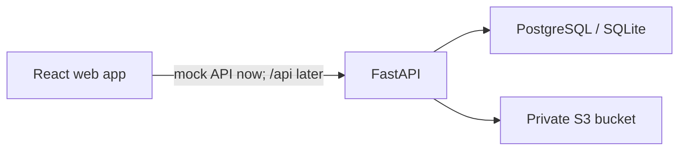

# Multi-Rate Pricing Calculator

A full-stack take-home project for creating pricing documents with per-line
discounts and taxes, enforcing a draft/finalized lifecycle, and reporting totals
over an issue-date range.

> **Current checkpoint:** the React frontend is implemented and verified against a
> deterministic mock API. The FastAPI service, database schema, S3 integration, and
> Railway deployment remain separate future phases.

## Links

| Surface | URL |
| --- | --- |
| Frontend | Pending Railway deployment |
| API | Pending implementation and deployment |
| OpenAPI | Pending backend implementation |
| Repository | <https://github.com/RahulGusai/pricing-calculator> |

No live application URL is claimed at this checkpoint.

## Frontend preview

The mock workspace includes demo access for
`avery@northstar.example` / `pricing123`.

| Visual | Purpose |
| --- | --- |
| [Approved direction](docs/visuals/revised-option-1.png) | Evolved Option 1 desktop target |
| [Light editor](docs/visuals/editor-light.jpg) | Operational editing workspace |
| [Dark editor](docs/visuals/editor-dark.jpg) | Low-glare editing workspace |
| [Reading editor](docs/visuals/editor-reading.jpg) | Distraction-reduced review workspace |
| [Calculation summary](docs/visuals/editor-light-summary.jpg) | Auditable server-returned totals |
| [Sign in](docs/visuals/login-light.jpg) | Demo authentication entry point |

## Product scope

- Email/password sign-up and login with strict per-user data isolation.
- Draft pricing documents with editable metadata and line items.
- Fixed or percentage discount per line, followed by percentage tax.
- Server-authoritative line and document totals with a documented rounding policy.
- Finalized documents that are immutable through every write path.
- Inclusive issue-date range reporting for document count, grand total, tax, and
  discount.
- Immutable finalized PDF artifacts in private S3-compatible object storage.
- Duplication of a finalized document into a new draft.

## Architecture



The relational database will be the source of truth for users, documents, line
items, status, and totals. S3 will store immutable generated artifacts, not the
mutable business record. Production will use PostgreSQL; SQLite remains a local and
focused-test convenience.

### Frontend - current phase

- React 19, TypeScript, and Vite.
- React Router for protected layouts and URL-addressable workflows.
- TanStack Query for asynchronous mock/API state and cache invalidation.
- React Hook Form and Zod for dynamic line-item forms and boundary validation.
- Mock Service Worker for a network-realistic, replaceable REST boundary.
- Phosphor icons with text labels for consequential actions.
- Bundled Manrope and Newsreader variable fonts, avoiding runtime font requests.
- Vitest, Testing Library, jest-dom, user-event, and jsdom for behavior-focused tests.
- The approved **Option 1 evolution**: an editorial financial workspace with
  high-density data where needed, quiet paper-like surfaces, and restrained accents.

These libraries have deliberately separate jobs. They do not calculate authoritative
totals or create a second domain layer in React. See
[ADR 0002](docs/decisions/0002-react-vite-mock-first.md) and the
[frontend design brief](docs/frontend-design-brief.md).

### Backend - planned

- FastAPI and Pydantic.
- SQLAlchemy 2 and Alembic.
- PostgreSQL on Railway; SQLite locally and in focused tests.
- Decimal calculations with integer minor units in persistence.
- Private S3-compatible storage with short-lived authorized downloads.

See [architecture](docs/architecture.md), the
[decision log](docs/decisions/README.md), and the
[product-pattern research](docs/research/frontend-product-patterns.md).

## Repository layout

```text
.
├── apps/
│   ├── api/          # FastAPI service boundary; not implemented yet
│   └── web/          # React frontend and mock API
├── docs/
│   ├── decisions/    # Architecture decision records
│   ├── research/     # First-party product-pattern evidence
│   ├── architecture.md
│   └── frontend-design-brief.md
├── AGENTS.md         # Repository-wide rules for agents and contributors
├── CONTRIBUTING.md
└── README.md
```

## Run the frontend

Prerequisites: a current Node.js LTS release and npm.

```bash
cd apps/web
npm ci
npm run dev
```

The web manifest currently defines these checks:

```bash
npm run test
npm run typecheck
npm run lint
npm run build
npm run test:sites
```

The frontend implementation handoff on 2026-08-10 passed test, typecheck, lint,
production build, and Sites packaging checks. Backend setup, migrations, end-to-end
startup, and live Railway verification remain pending implementation.

## Mock-first contract

The frontend talks to Mock Service Worker handlers rather than importing fixtures
inside components. The mock boundary models latency, authentication, ownership,
validation, draft/finalized conflicts, reports, and server-shaped decimal-string
totals. Deterministic fixtures include the assignment reference document and an
isolated second tenant.

When FastAPI exists, its OpenAPI schema becomes the contract source of truth. A
conformance pass will compare status codes, error envelopes, field names, decimal
serialization, and lifecycle behavior before the mock is retired.

## Calculation policy

All values enter and leave the API as fixed decimal strings. Binary floating point
is forbidden for authoritative calculations. For each line, monetary components are
rounded to two decimal places using `ROUND_HALF_UP`:

1. `subtotal = round(quantity x unit_price)`
2. `discount = fixed_amount` or `round(subtotal x percent / 100)`
3. `after_discount = subtotal - discount`
4. `tax = round(after_discount x tax_percent / 100)`
5. `line_total = after_discount + tax`

Document totals sum the already-rounded line values. A fixed discount greater than
the line subtotal is rejected rather than clamped. During the frontend-only phase,
the mock service reproduces this policy; FastAPI will become authoritative.

The assignment reference must produce:

| Total | Amount |
| --- | ---: |
| Subtotal | 450.00 |
| Discount | 40.00 |
| Tax | 11.50 |
| Grand total | **421.50** |

## Document lifecycle

- New documents are drafts.
- Only drafts may change metadata, ordering, or line items.
- Finalization recalculates and validates the entire document server-side.
- A finalized document cannot be edited or deleted through normal CRUD endpoints.
- Duplication creates new IDs and a new draft; it never reopens the source.
- Artifact access is authorized by the API before a short-lived download is issued.

## Deployment intent

The monorepo is intended for two independently built Railway services plus Railway
PostgreSQL. The frontend will serve its production bundle and route API traffic to
FastAPI; the API alone will receive database and S3 credentials. Railway services,
domains, environment values, health checks, and live URLs are not configured yet.

## Assumptions and production follow-ups

- Report date bounds are inclusive and default to all document statuses.
- Currency is stored per document; the first UI iteration displays USD.
- Quantity supports up to four decimal places; money and rates accept two.
- A draft may be empty, but finalization requires at least one valid line.
- Railway's ephemeral filesystem is never durable document storage.

Before production, add hardened session management, CSRF protection where
applicable, optimistic concurrency, a durable artifact outbox, audit events,
structured tracing, rate limiting, backups, S3 lifecycle/versioning, security
scanning, and measured load/accessibility budgets.

## Contributing

Read [AGENTS.md](AGENTS.md) before making changes and follow
[CONTRIBUTING.md](CONTRIBUTING.md). The selected Option 1 direction is approved for
frontend work; backend implementation remains a separate phase.
