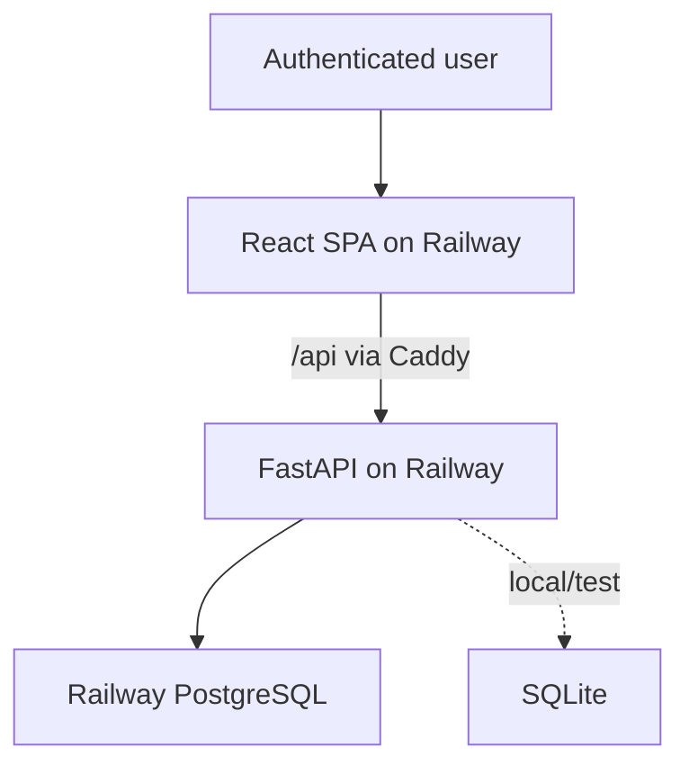
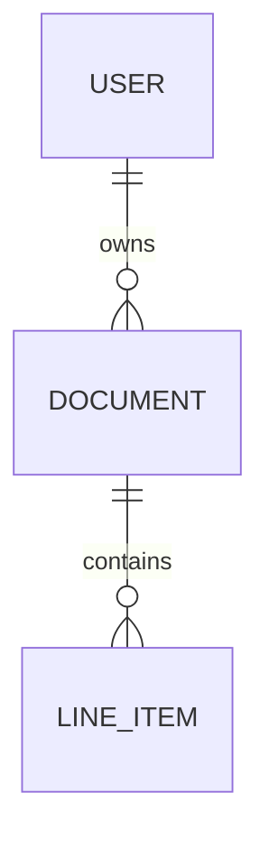

# Architecture

## Goals

- Make pricing calculations exact and independently testable.
- Enforce ownership and finalization in the backend, not only in the UI.
- Keep local setup light without designing production around SQLite.
- Keep printable output simple and stateless through browser preview/printing.
- Deploy the web and API independently from one understandable repository.

## System context

The Caddy proxy gives the browser one origin while API traffic can use Railway's
private network. FastAPI may still expose a public domain for review/OpenAPI.

## Domain model

`DOCUMENT` materializes totals calculated from its `LINE_ITEM` inputs. There is no
artifact entity: printable output is derived in the browser from an authorized
document response.

## Critical flows

### Draft mutation

Authenticate, load by document ID and owner ID, reject finalized state, validate the
input, recalculate the affected document through the one pricing module, and commit
inputs plus totals atomically.

### Finalization

Lock the owned draft, recalculate every line, require a valid non-empty document, and
atomically persist final totals plus the finalized lifecycle state. No external I/O
occurs during finalization.

### Deletion

Draft and finalized documents may be permanently deleted by their authenticated owner
only when the request body contains `{ "confirm": true }`. Finalized content remains
immutable until the whole relational record is deleted. The frontend also requires
explicit confirmation for this irreversible operation.

### Reporting

Aggregate materialized document totals by owner and inclusive issue-date bounds,
returning one row per currency. Aggregate from documents rather than a joined
line-item result to avoid multiplying totals.

### Printable preview

The frontend renders an authorized document response in a print-specific dialog and
uses the browser print dialog. The API does not create files or download URLs.

## Security boundaries

- Normalize unique emails and hash passwords with Argon2id.
- Store only a SHA-256 hash of each opaque session cookie; derive the in-memory CSRF
  token from the raw cookie and a server secret.
- Scope repository queries by owner, returning `404` for inaccessible IDs.
- Accept no client-controlled totals, status transitions, or owner IDs.
- Keep secrets server-side and explicitly enumerate allowed public configuration.
- Validate money/rate decimal precision, whole-number quantity bounds, identifiers, and
  date range ordering.

## Deployment topology

One Railway project contains `web`, `api`, and PostgreSQL. The two application
services point at isolated monorepo roots and use Railpack. The service-specific
`railway.json` files, Alembic pre-deploy command, Vite/Caddy proxy, and production
configuration validation are implemented; provisioning and a live Railway
verification remain pending.

## Deliberate follow-ups

See the ADR index for status and consequences. The evolved Option 1 editorial
workspace is the approved frontend direction. React consumes checked-in FastAPI
OpenAPI declarations through its cookie-session/CSRF API adapter; MSW is now an
explicit test/visual double rather than the runtime source of state.
