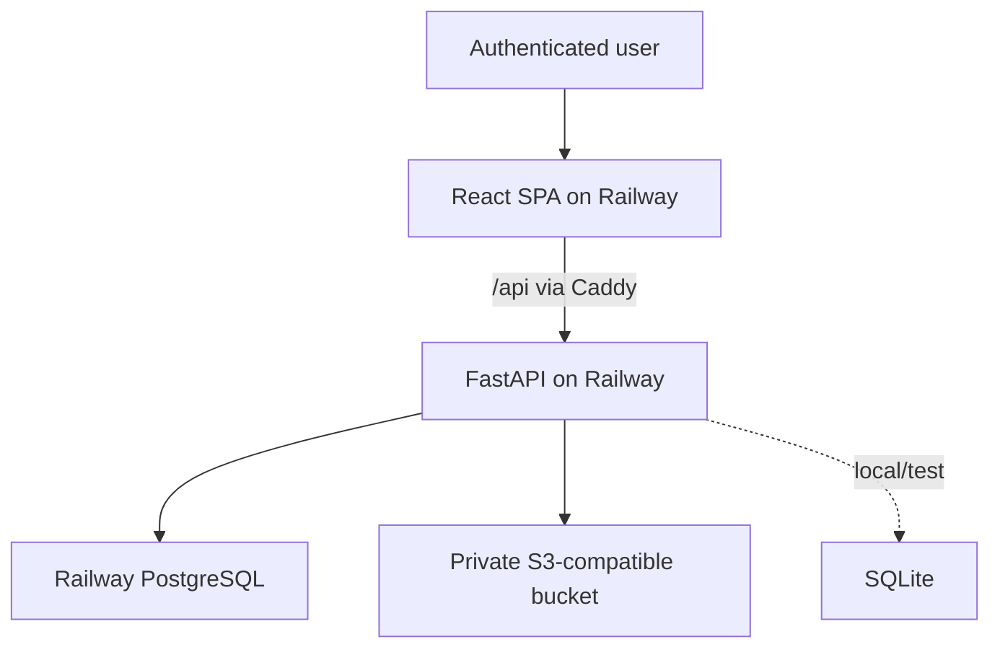
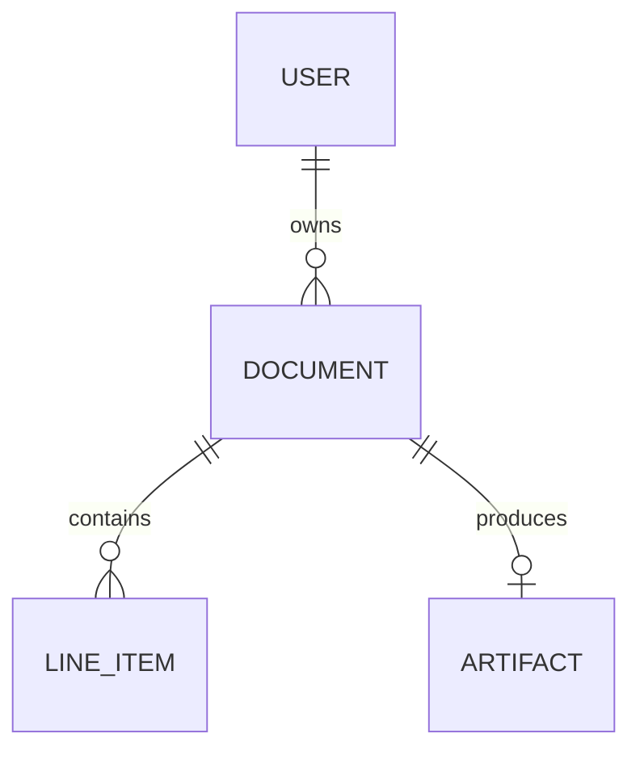

# Architecture

## Goals

- Make pricing calculations exact and independently testable.
- Enforce ownership and finalization in the backend, not only in the UI.
- Keep local setup light without designing production around SQLite.
- Keep generated documents durable without making object storage queryable state.
- Deploy the web and API independently from one understandable repository.

## System context

The Caddy proxy gives the browser one origin while API traffic can use Railway's
private network. FastAPI may still expose a public domain for review/OpenAPI.

## Domain model

`DOCUMENT` materializes totals calculated from its `LINE_ITEM` inputs. `ARTIFACT`
stores an object key, checksum, content type, size, and generation state; signed URLs
are never persisted.

## Critical flows

### Draft mutation

Authenticate, load by document ID and owner ID, reject finalized state, validate the
input, recalculate the affected document through the one pricing module, and commit
inputs plus totals atomically.

### Finalization

Read the owned draft snapshot, recalculate all lines, require a valid non-empty
document, and render the immutable PDF. The service ends its database transaction
before the S3-compatible upload so it never holds a database lock during external
I/O. It then takes a short row lock, verifies `updated_at` has not changed, persists
artifact metadata, and transitions status. An upload failure or concurrent draft
edit leaves the document unfinalized; a newly uploaded orphan is best-effort removed.
A durable outbox is the production evolution.

### Deletion

Draft and finalized documents may be permanently deleted by their authenticated owner
only when the request body contains `{ "confirm": true }`. Finalized content remains
immutable until the whole record is deleted. For an artifact-bearing document, the
service commits a `deleting` intent, deletes the private object outside its database
transaction, then removes the relational record. A storage failure restores `ready`
and keeps the document; an interrupted final database deletion is safe to retry. The
frontend also requires explicit confirmation for this irreversible operation.

### Reporting

Aggregate materialized document totals by owner and inclusive issue-date bounds.
Aggregate from documents rather than a joined line-item result to avoid multiplying
totals.

### Artifact download

Authorize the owned document, verify the artifact is ready, and return or redirect to
a short-lived presigned URL. Buckets stay private.

## Security boundaries

- Normalize unique emails and hash passwords with Argon2id.
- Store only a SHA-256 hash of each opaque session cookie; derive the in-memory CSRF
  token from the raw cookie and a server secret.
- Scope repository queries by owner, returning `404` for inaccessible IDs.
- Accept no client-controlled totals, status transitions, owner IDs, or object keys.
- Keep secrets server-side and explicitly enumerate allowed public configuration.
- Validate decimal precision, bounds, identifiers, and date range ordering.

## Deployment topology

One Railway project will contain `web`, `api`, PostgreSQL, and object storage. The two
application services point at isolated monorepo roots. The API Dockerfile,
`railway.json`, Alembic pre-deploy command, and production configuration validation
are implemented; provisioning and a live Railway verification remain pending.

## Deliberate follow-ups

See the ADR index for status and consequences. The evolved Option 1 editorial
workspace is the approved frontend direction; the frontend still needs the documented
mock-to-FastAPI conformance pass.
