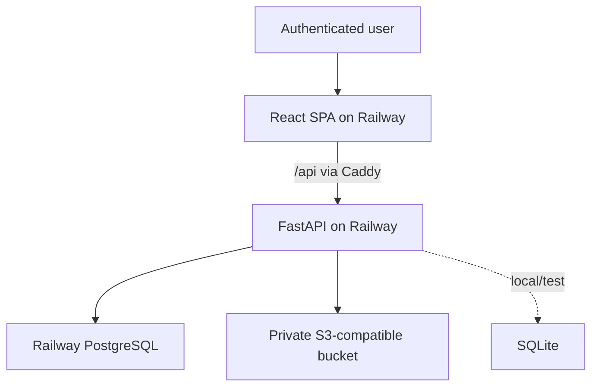
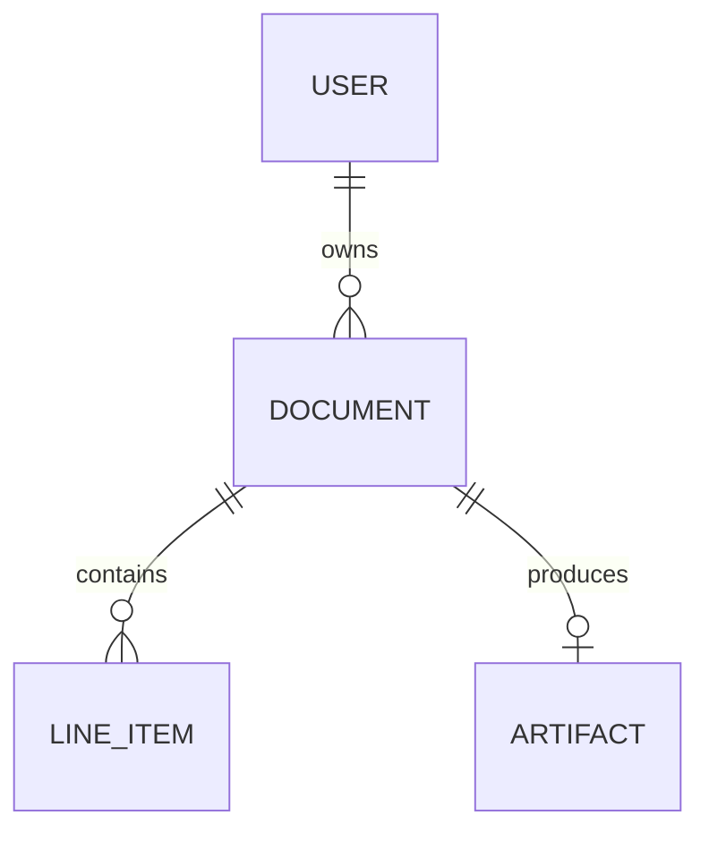

# Architecture

## Goals

- Make pricing calculations exact and independently testable.
- Enforce ownership and finalization in the backend, not only in the UI.
- Keep local setup light without designing production around SQLite.
- Keep generated documents durable without making object storage queryable state.
- Deploy the web and API independently from one understandable repository.

## System context

The Caddy proxy gives the browser one origin while API traffic can use Railway's
private network. FastAPI may still expose a public domain for review/OpenAPI.

## Domain model

`DOCUMENT` materializes totals calculated from its `LINE_ITEM` inputs. `ARTIFACT`
stores an object key, checksum, content type, size, and generation state; signed URLs
are never persisted.

## Critical flows

### Draft mutation

Authenticate, load by document ID and owner ID, reject finalized state, validate the
input, recalculate the affected document through the one pricing module, and commit
inputs plus totals atomically.

### Finalization

Lock the owned draft, recalculate all lines, require a valid non-empty document,
generate/upload the immutable PDF, persist artifact metadata, and transition status.
A synchronous upload is acceptable for the take-home if failure leaves the draft
unfinalized and is surfaced clearly. A durable outbox is the production evolution.

### Reporting

Aggregate materialized document totals by owner and inclusive issue-date bounds.
Aggregate from documents rather than a joined line-item result to avoid multiplying
totals.

### Artifact download

Authorize the owned document, verify the artifact is ready, and return or redirect to
a short-lived presigned URL. Buckets stay private.

## Security boundaries

- Normalize unique emails and hash passwords with Argon2id.
- Scope repository queries by owner, returning `404` for inaccessible IDs.
- Accept no client-controlled totals, status transitions, owner IDs, or object keys.
- Keep secrets server-side and explicitly enumerate allowed public configuration.
- Validate decimal precision, bounds, identifiers, and date range ordering.

## Deployment topology

One Railway project will contain `web`, `api`, PostgreSQL, and object storage. The two
application services point at isolated monorepo roots. Production configuration and
exact deployment commands will be added and verified with the implementation.

## Known pre-implementation choices

See the ADR index for status and consequences. Visual hierarchy and detailed frontend
interaction patterns remain intentionally open until the user selects a design.
