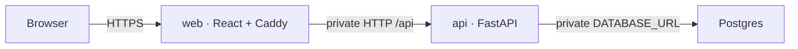

# Railway deployment

Deploy the repository as two isolated application services plus Railway PostgreSQL.
The recommended topology exposes only the `web` service publicly. Caddy serves the
React bundle and reverse-proxies browser requests under `/api/*` to FastAPI over
Railway private networking.

No bucket, volume, S3 credential, or local artifact directory is required. PostgreSQL
stores the complete canonical document record, while the frontend provides the only
printable preview.

## Target topology



Use these exact service names if copying the reference variables below:

| Service | Source | Root Directory | Railway config path | Public domain |
| --- | --- | --- | --- | --- |
| `api` | This GitHub repository | `/apps/api` | `/apps/api/railway.json` | Optional |
| `web` | This GitHub repository | `/apps/web` | `/apps/web/railway.json` | Required |
| `Postgres` | Railway PostgreSQL | n/a | n/a | Never required by the app |

Railway treats Root Directory and the custom config path as separate settings. The
config path remains absolute from the repository root even after a service Root
Directory is set.

## 1. Prepare the repository

1. Run the local checks described in the root README.
2. Commit the generated OpenAPI declaration, Alembic migration, Dockerfiles,
   `railway.json` files, and this guide.
3. Push the branch that Railway should deploy to GitHub.
4. Confirm no `.env`, database, generated PDF, or credential file is committed.

## 2. Create the Railway project and PostgreSQL

1. Create an empty Railway project.
2. Use **+ New → Database → PostgreSQL** and keep the service name `Postgres`.
3. Do not create a TCP proxy for application traffic and do not add a storage bucket.
4. Keep all three services in the same Railway project and environment so reference
   variables and private networking resolve correctly.

## 3. Configure the API service

1. Add an empty service named `api` and connect it to the GitHub repository.
2. In **Settings → Source**, select the deployment branch.
3. Set **Root Directory** to `/apps/api`.
4. Set the custom Railway config path to `/apps/api/railway.json`.
5. Add these service variables:

```dotenv
APP_ENVIRONMENT=production
PORT=8000
DATABASE_URL=${{Postgres.DATABASE_URL}}
CORS_ALLOWED_ORIGINS=
PRICING_SUPPORTED_CURRENCIES=USD,INR,AED
PRICING_DEFAULT_CURRENCY=USD
SESSION_COOKIE_NAME=pricing_session
SESSION_COOKIE_SECURE=true
SESSION_TTL_HOURS=8
CSRF_SECRET=replace-with-a-long-unique-random-secret
```

Generate `CSRF_SECRET` with a password manager or cryptographically secure secret
generator. Do not reuse the development value and do not expose it to the web service.

6. Deploy `api`. Its config runs `alembic upgrade head` as a pre-deploy command before
   starting Uvicorn. A failed migration stops the new deployment.
7. Confirm the deployment health check for `/health` passes.
8. A public API domain is optional. Generate one only if reviewers need direct access
   to `/docs`, `/openapi.json`, or `/health`; the application itself does not need it.

The checked-in Uvicorn command binds to `::` and port `$PORT`, which works with
Railway's current dual-stack private network and older IPv6-only environments.

## 4. Configure the web reverse proxy

1. Add a second empty service named `web` and connect it to the same repository and
   branch.
2. Set **Root Directory** to `/apps/web`.
3. Set the custom Railway config path to `/apps/web/railway.json`.
4. Add this service variable:

```dotenv
API_UPSTREAM=http://${{api.RAILWAY_PRIVATE_DOMAIN}}:${{api.PORT}}
```

`api.PORT` is the explicit `PORT=8000` variable created in the previous section; it is
not Railway's automatically injected runtime port. Internal traffic uses `http`, not
`https`, because it stays inside Railway's encrypted private network.

5. Deploy `web`. The Docker image builds the Vite bundle and serves it with Caddy.
6. In **Settings → Networking → Public Networking**, choose **Generate Domain** for
   `web`. This is the only URL users need.

Caddy already implements the reverse proxy:

```caddyfile
handle /api/* {
    reverse_proxy {$API_UPSTREAM}
}
```

Browser requests therefore remain same-origin, `CORS_ALLOWED_ORIGINS` stays empty, and
the API session cookie works without exposing a second public service.

## 5. Verify the deployed stack

Run these checks against the generated web domain:

1. `GET /health` returns `200` and `ok` from Caddy.
2. `GET /api/v1/config/currencies` returns USD, INR, and AED through the proxy.
3. Sign up with a fresh test account and confirm login survives a page refresh.
4. Create the documented `421.50` pricing example and wait for autosave to finish.
5. Open Preview, verify the print layout, then finalize the document.
6. Confirm finalized content is read-only and no PDF download action is present.
7. Create documents in at least two currencies, run an inclusive date report, and
   verify one totals row appears for each currency.
8. Redeploy `api` and confirm the account and documents still exist in PostgreSQL.
9. Delete one draft and one finalized document through the explicit confirmation flow.

## Alternative: public API without Caddy proxy

The same-origin Caddy route is recommended. If a separate public API is required:

1. Generate public domains for both `api` and `web`.
2. Build the frontend with `VITE_API_URL=https://${{api.RAILWAY_PUBLIC_DOMAIN}}`.
3. Set `CORS_ALLOWED_ORIGINS=https://${{web.RAILWAY_PUBLIC_DOMAIN}}` on `api`.
4. Keep `SESSION_COOKIE_SECURE=true` and verify credentialed CORS and cookie behavior
   in the deployed browser.

This alternative adds CORS and public API exposure without improving the normal user
flow, so use it only when direct API access is an explicit requirement.

## Migrations and rollback

`apps/api/railway.json` runs the Alembic pre-deploy command in a separate container
with access to private networking and service variables. Migration `0002` removes the
retired artifact metadata table. It does not inspect or delete historical local files;
those files are outside the deployed architecture.

Never rewrite an applied migration. To roll the application back across a schema
change, deploy compatible code or apply a deliberate forward migration after reviewing
the data consequences.

## Troubleshooting

### Railway ignores `railway.json`

Confirm the custom config paths are `/apps/api/railway.json` and
`/apps/web/railway.json`. Root Directory does not make the config path relative.

### `/api/*` returns 502 from the web domain

- Confirm both services are in the same project and environment.
- Confirm `api` has the explicit variable `PORT=8000`.
- Confirm `API_UPSTREAM` references the exact service name `api`.
- Confirm Uvicorn is listening on `::` and the API `/health` check is passing.
- Do not use the API public URL as the first workaround; fix private networking.

### API deployment fails before startup

Inspect the pre-deploy logs. Verify `DATABASE_URL=${{Postgres.DATABASE_URL}}` resolves,
PostgreSQL is healthy, and the migration exits successfully.

### Login works but disappears after refresh

Confirm the browser uses the web domain for `/api/*`, `SESSION_COOKIE_SECURE=true`,
and no direct `VITE_API_URL` bypasses Caddy in the recommended topology.

### Refreshing a frontend route returns 404

Confirm the web image is using the checked-in Caddyfile. Its `try_files` rule routes
unknown paths to `index.html` for React Router.

## References

- [Railway monorepo deployment](https://docs.railway.com/deployments/monorepo)
- [Railway config as code](https://docs.railway.com/config-as-code)
- [Railway private networking](https://docs.railway.com/private-networking)
- [Railway PostgreSQL](https://docs.railway.com/databases/postgresql)
- [Railway pre-deploy commands](https://docs.railway.com/deployments/pre-deploy-command)
- [Railway domains](https://docs.railway.com/networking/domains/working-with-domains)
